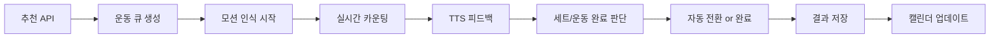

# 🏋️‍♀️ 통합 운동 시스템 구현 워크플로우

> **추천 시스템 ↔ 모션 인식 ↔ TTS 피드백의 완전한 유기적 연결**

## 📋 프로젝트 개요

현재 FitMate의 운동 추천 시스템과 모션 인식 시스템이 분리되어 작동하고 있어, 사용자가 원하는 유기적인 운동 경험을 제공하지 못하고 있습니다. 

**목표 시나리오:**
```
1. 추천 받기: "푸시업 3세트 5회, 윗몸일으키기 4세트 10회"
2. 모션 코치 시작 → 첫 번째 운동(푸시업) 자동 시작
3. 푸시업 5회 인식 완료 → TTS "1세트 완료! 휴식하세요" 
4. 3세트 완료 → 자동으로 윗몸일으키기로 전환 + TTS 안내
5. 전체 운동 완료 → 결과 집계 → 캘린더 저장 → 알림 메시지
```

## 🚀 Phase 1: 아키텍처 설계 및 데이터 모델링 (3-4일)

### 1.1 통합 세션 관리 컴포넌트 설계

**새로운 핵심 컴포넌트:** `IntegratedWorkoutSession.tsx`
```
위치: frontend/src/features/workout/components/IntegratedWorkoutSession.tsx
```

**핵심 상태 관리 인터페이스:**
```typescript
interface IntegratedWorkoutState {
  // 운동 큐 관리
  exerciseQueue: RecommendedExercise[];
  currentExerciseIndex: number;
  
  // 현재 진행 상황
  currentExercise: RecommendedExercise | null;
  currentSet: number;
  currentRep: number;
  targetReps: number;
  
  // 세션 상태
  sessionStatus: 'preparing' | 'exercising' | 'resting' | 'transitioning' | 'completed';
  restTimeRemaining: number;
  
  // 결과 집계
  completedExercises: ExerciseResult[];
  sessionStartTime: Date;
  sessionId: number | null;
  
  // TTS 상태
  currentTTSMessage: string | null;
  ttsEnabled: boolean;
}
```

### 1.2 데이터 플로우 설계



### 1.3 백엔드 API 확장

**새로운 엔드포인트:**
```java
// 통합 세션 관리
POST   /api/integrated-workout/start-session     // 세션 시작 + 추천 생성
PUT    /api/integrated-workout/update-progress   // 실시간 진행 업데이트  
POST   /api/integrated-workout/complete-exercise // 개별 운동 완료
POST   /api/integrated-workout/complete-session  // 전체 세션 완료

// TTS 지원
POST   /api/tts/workout-feedback                 // 운동 피드백 음성
POST   /api/tts/exercise-transition              // 운동 전환 안내 음성
```

## 📱 Phase 2: 프론트엔드 통합 컴포넌트 구현 (5-6일)

### 2.1 IntegratedWorkoutSession 컴포넌트 개발

**컴포넌트 구조:**
```tsx
IntegratedWorkoutSession/
├── WorkoutHeader              // 진행률, 시간, 칼로리, 현재 운동
├── ExerciseInstructions      // 현재 운동 가이드 + TTS 버튼
├── PoseDetectionArea         // 모션 인식 + 실시간 피드백
├── ProgressTracker           // 세트/횟수 진행 표시
├── RestTimer                 // 세트 간 휴식 타이머 + TTS
├── ControlButtons            // 수동 완료, 스킵, 일시정지
├── TTSController             // 음성 피드백 설정
└── SessionSummary            // 운동 완료 후 결과 요약
```

### 2.2 TTS 통합 운동 피드백 시스템

**TTS 메시지 카테고리:**
```typescript
interface WorkoutTTSMessages {
  // 운동 시작/전환
  exerciseStart: (exerciseName: string, sets: number, reps: number) => string;
  exerciseTransition: (fromExercise: string, toExercise: string) => string;
  
  // 실시간 피드백
  repCompleted: (currentRep: number, targetReps: number) => string;
  setCompleted: (currentSet: number, totalSets: number, restTime: number) => string;
  formCorrection: (feedback: string) => string;
  
  // 동기부여 및 완료
  encouragement: () => string;
  sessionCompleted: (totalExercises: number, duration: number, calories: number) => string;
  
  // 휴식 안내
  restRemaining: (seconds: number) => string;
  restComplete: () => string;
}
```

**TTS 피드백 예시:**
```typescript
const ttsMessages: WorkoutTTSMessages = {
  exerciseStart: (name, sets, reps) => `${name} ${sets}세트 ${reps}회를 시작합니다. 준비되셨나요?`,
  repCompleted: (current, target) => current === target ? 
    "목표 달성! 잠시 쉬어주세요." : `${current}회 완료, ${target - current}회 남았어요!`,
  setCompleted: (current, total, rest) => 
    `${current}세트 완료! ${rest}초간 휴식하세요. ${total - current}세트 남았습니다.`,
  formCorrection: (feedback) => `자세 교정: ${feedback}`,
  encouragement: () => ["잘하고 있어요!", "화이팅!", "조금만 더!"][Math.floor(Math.random() * 3)],
  sessionCompleted: (exercises, duration, calories) => 
    `축하합니다! ${exercises}개 운동을 ${duration}분만에 완료하여 ${calories}칼로리를 소모했어요!`
};
```

### 2.3 스마트 모션 인식 통합

**기존 `PoseDetector` 개선:**
```typescript
interface SmartMotionTracker {
  // 운동별 목표 설정
  setExerciseTarget: (exerciseName: string, sets: number, reps: number) => void;
  
  // 실시간 진행 추적
  onRepCompleted: (callback: (currentRep: number) => void) => void;
  onSetCompleted: (callback: (currentSet: number) => void) => void;
  onExerciseCompleted: (callback: (totalSets: number, accuracy: number) => void) => void;
  
  // 폼 피드백 + TTS 연동
  onFormFeedback: (callback: (feedback: string, shouldSpeak: boolean) => void) => void;
  
  // 운동 자동 전환
  switchExercise: (newExercise: string) => void;
}
```

## 🔧 Phase 3: 백엔드 서비스 확장 (4-5일)

### 3.1 IntegratedWorkoutSessionService 구현

```java
@Service
public class IntegratedWorkoutSessionService {
    
    @Autowired
    private AdaptiveWorkoutRecommendationService recommendationService;
    
    @Autowired
    private TextToSpeechService ttsService;
    
    @Autowired
    private WorkoutSessionRepository sessionRepository;
    
    /**
     * 통합 세션 시작 - 추천 + 세션 생성을 한 번에
     */
    public IntegratedSessionResponse startIntegratedSession(User user, String goal, Integer duration) {
        // 1. 운동 추천 생성
        Map<String, Object> recommendation = recommendationService.generateAdaptiveRecommendation(user, Map.of(
            "goal", goal,
            "targetDuration", duration
        ));
        
        // 2. 세션 생성 및 저장
        WorkoutSession session = WorkoutSession.builder()
                .user(user)
                .goal(goal)
                .plannedDuration(duration)
                .sessionDate(LocalDateTime.now())
                .build();
        session = sessionRepository.save(session);
        
        // 3. 운동 큐 구성
        List<ExerciseQueueItem> exerciseQueue = buildExerciseQueue(recommendation);
        
        // 4. 첫 번째 운동 TTS 메시지 생성
        String welcomeMessage = generateWelcomeTTS(exerciseQueue.get(0));
        
        return IntegratedSessionResponse.builder()
                .sessionId(session.getId())
                .recommendation(recommendation)
                .exerciseQueue(exerciseQueue)
                .welcomeTTSMessage(welcomeMessage)
                .build();
    }
    
    /**
     * 실시간 운동 진행 업데이트
     */
    public ExerciseProgressResponse updateExerciseProgress(
            Long sessionId, String exerciseName, int currentSet, int currentRep) {
        
        // 진행 상황 업데이트
        ExerciseProgress progress = updateProgressInDatabase(sessionId, exerciseName, currentSet, currentRep);
        
        // TTS 피드백 메시지 생성
        String ttsMessage = generateProgressTTS(progress);
        
        return ExerciseProgressResponse.builder()
                .progress(progress)
                .ttsMessage(ttsMessage)
                .shouldTriggerTTS(progress.isSignificantMilestone())
                .build();
    }
    
    /**
     * 개별 운동 완료 처리
     */
    public ExerciseCompletionResponse completeExercise(Long sessionId, ExerciseCompletionRequest request) {
        // 운동 실행 기록 저장
        ExerciseExecution execution = saveExerciseExecution(sessionId, request);
        
        // 다음 운동 정보 조회
        ExerciseQueueItem nextExercise = getNextExercise(sessionId, request.getExerciseName());
        
        // 전환 TTS 메시지 생성
        String transitionMessage = generateTransitionTTS(request.getExerciseName(), nextExercise);
        
        return ExerciseCompletionResponse.builder()
                .completedExecution(execution)
                .nextExercise(nextExercise)
                .transitionTTSMessage(transitionMessage)
                .isSessionComplete(nextExercise == null)
                .build();
    }
    
    /**
     * 전체 세션 완료 및 결과 저장
     */
    public SessionCompletionResponse completeSession(Long sessionId, SessionSummaryRequest summary) {
        // 세션 완료 처리
        WorkoutSession session = finalizeSession(sessionId, summary);
        
        // 캘린더 기록 자동 생성
        WorkoutRecord calendarRecord = createCalendarRecord(session);
        
        // 완료 축하 TTS 메시지
        String congratsMessage = generateCompletionTTS(session, summary);
        
        // 다음 추천을 위한 피드백 학습
        learnFromSession(session);
        
        return SessionCompletionResponse.builder()
                .session(session)
                .calendarRecord(calendarRecord)
                .completionTTSMessage(congratsMessage)
                .nextRecommendationHint(generateNextWorkoutHint(session.getUser()))
                .build();
    }
    
    /**
     * 운동별 TTS 메시지 생성
     */
    private String generateProgressTTS(ExerciseProgress progress) {
        if (progress.isRepCompleted()) {
            return String.format("%d회 완료! %d회 남았어요!", 
                progress.getCurrentRep(), 
                progress.getTargetReps() - progress.getCurrentRep());
        } else if (progress.isSetCompleted()) {
            return String.format("%d세트 완료! %d초간 휴식하세요.", 
                progress.getCurrentSet(), 
                progress.getRestSeconds());
        } else if (progress.needsEncouragement()) {
            return getRandomEncouragement();
        }
        return null;
    }
}
```

### 3.2 TTS 메시지 최적화 서비스

```java
@Service
public class WorkoutTTSOptimizer {
    
    /**
     * 운동 가이드용 TTS 합성 (느린 속도, 명확한 발음)
     */
    public byte[] synthesizeWorkoutFeedback(String message, TTSPriority priority) {
        AudioConfig audioConfig = AudioConfig.newBuilder()
                .setAudioEncoding(AudioEncoding.MP3)
                .setSpeakingRate(priority == TTSPriority.URGENT ? 0.9f : 0.8f)  // 긴급한 경우 조금 빠르게
                .setPitch(priority == TTSPriority.ENCOURAGEMENT ? 0.2f : 0.0f)   // 격려 메시지는 밝은 톤
                .setVolumeGainDb(priority == TTSPriority.URGENT ? 3.0f : 2.0f)   // 긴급한 경우 더 크게
                .build();

        return textToSpeechService.synthesizeSpeech(message, "ko-KR-Standard-A", "ko-KR", audioConfig);
    }
    
    /**
     * 운동 상황별 최적화된 음성 설정
     */
    public TTSConfig getOptimalTTSConfig(WorkoutContext context) {
        return switch (context.getPhase()) {
            case WARM_UP -> TTSConfig.builder()
                    .rate(0.8f).pitch(0.0f).volume(2.0f).voice("ko-KR-Standard-B").build();
            case MAIN_EXERCISE -> TTSConfig.builder()
                    .rate(0.9f).pitch(0.1f).volume(3.0f).voice("ko-KR-Standard-A").build();
            case REST -> TTSConfig.builder()
                    .rate(0.7f).pitch(-0.1f).volume(1.5f).voice("ko-KR-Standard-B").build();
            case COOL_DOWN -> TTSConfig.builder()
                    .rate(0.7f).pitch(-0.2f).volume(1.8f).voice("ko-KR-Standard-C").build();
        };
    }
}

enum TTSPriority {
    URGENT,        // 자세 교정, 위험 상황
    ENCOURAGEMENT, // 동기부여, 축하
    INFORMATION,   // 일반 정보, 진행 상황
    AMBIENT        // 배경 안내, 부가 정보
}
```

## 🎯 Phase 4: 사용자 경험 개선 (3-4일)

### 4.1 스마트 전환 로직 구현

```typescript
class SmartWorkoutTransition {
  private transitionThresholds = {
    minimumRestTime: 30,      // 최소 휴식 시간 (초)
    autoTransitionDelay: 5,   // 자동 전환 지연 (초)
    formAccuracyThreshold: 0.8 // 자세 정확도 임계값
  };

  /**
   * 다음 운동으로 자동 전환 판단
   */
  shouldTransitionToNextExercise(currentState: WorkoutState): boolean {
    const { currentExercise, motionResults, restTimeElapsed } = currentState;
    
    return (
      // 모든 세트 완료
      currentExercise.completedSets >= currentExercise.plannedSets &&
      // 자세 정확도 충족
      motionResults.averageAccuracy > this.transitionThresholds.formAccuracyThreshold &&
      // 충분한 휴식 시간
      restTimeElapsed >= this.transitionThresholds.minimumRestTime &&
      // 마지막 동작 완전히 인식됨
      motionResults.isMovementComplete
    );
  }

  /**
   * TTS와 함께하는 부드러운 전환
   */
  async executeTransition(fromExercise: Exercise, toExercise: Exercise): Promise<void> {
    // 1. 완료 축하 + TTS
    await this.playTTS(`${fromExercise.name} 완료! 정말 잘하셨어요!`);
    await this.delay(2000);

    // 2. 다음 운동 안내 + TTS
    await this.playTTS(
      `다음은 ${toExercise.name} ${toExercise.sets}세트 ${toExercise.reps}회입니다. 5초 후 시작됩니다.`
    );
    
    // 3. 카운트다운 + TTS
    for (let i = 5; i > 0; i--) {
      await this.playTTS(i.toString());
      await this.delay(1000);
    }
    
    // 4. 운동 시작 신호 + TTS
    await this.playTTS("시작!");
    
    // 5. 모션 인식 전환
    this.motionTracker.switchExercise(toExercise.name);
  }
}
```

### 4.2 지능형 피드백 시스템

```typescript
class IntelligentFeedbackSystem {
  private feedbackHistory: Map<string, FeedbackPattern> = new Map();
  
  /**
   * 사용자 패턴 학습 기반 피드백 최적화
   */
  generateContextualFeedback(
    exerciseName: string, 
    currentForm: FormAnalysis, 
    userProgress: UserProgress
  ): TTSFeedback {
    
    const userPattern = this.feedbackHistory.get(exerciseName);
    const feedbackStyle = this.determineFeedbackStyle(userPattern, userProgress);
    
    return {
      message: this.craftMessage(currentForm, feedbackStyle),
      priority: this.calculatePriority(currentForm),
      timing: this.optimizeTiming(exerciseName, currentForm),
      voiceConfig: this.selectVoiceConfig(feedbackStyle)
    };
  }
  
  /**
   * 동기부여 수준에 따른 메시지 조절
   */
  private craftMessage(form: FormAnalysis, style: FeedbackStyle): string {
    if (form.isCorrect) {
      return style.motivationLevel === 'high' ? 
        "완벽해요! 이 자세를 유지하세요!" : 
        "좋습니다. 계속하세요.";
    } else {
      return style.correctionStyle === 'gentle' ?
        `${form.suggestion} 해보세요` :
        `자세 교정: ${form.correction}`;
    }
  }
}
```

### 4.3 예외 상황 처리 및 사용자 제어

```typescript
interface WorkoutFailsafeSystem {
  // 모션 인식 실패 시
  handleMotionDetectionFailure: () => void;
  
  // 중도 포기 시
  handleWorkoutAbandonment: (reason: string) => void;
  
  // 운동 순서 변경 요청
  handleExerciseReorder: (newOrder: string[]) => void;
  
  // TTS 음성 조절
  handleTTSControl: (action: 'mute' | 'unmute' | 'volume' | 'speed') => void;
}
```

## 🧪 Phase 5: 테스팅 및 검증 (2-3일)

### 5.1 통합 테스트 시나리오

```typescript
describe('통합 운동 시스템 E2E 테스트', () => {
  test('완전한 운동 세션 플로우', async () => {
    // 1. 추천 받기
    const recommendation = await getWorkoutRecommendation('diet', 30);
    expect(recommendation.workoutPlan.main.exercises).toHaveLength(5);
    
    // 2. 통합 세션 시작
    const session = await startIntegratedSession(recommendation);
    expect(session.sessionId).toBeDefined();
    expect(session.exerciseQueue).toHaveLength(5);
    
    // 3. 첫 번째 운동 실행 (푸시업 3세트 5회)
    const firstExercise = session.exerciseQueue[0];
    await simulateExerciseExecution(firstExercise, {
      sets: 3,
      repsPerSet: 5,
      formAccuracy: 0.85
    });
    
    // 4. TTS 피드백 검증
    expect(ttsMessages).toContain('1세트 완료');
    expect(ttsMessages).toContain('다음은 윗몸일으키기');
    
    // 5. 자동 전환 확인
    await waitForExerciseTransition();
    expect(currentExercise.name).toBe('윗몸일으키기');
    
    // 6. 전체 세션 완료
    await completeAllExercises();
    
    // 7. 결과 저장 및 캘린더 업데이트 확인
    const savedRecord = await getWorkoutRecord(session.sessionId);
    expect(savedRecord.status).toBe('COMPLETED');
    expect(savedRecord.calendarEntry).toBeDefined();
  });

  test('TTS 피드백 시나리오', async () => {
    const ttsService = new MockTTSService();
    
    // 운동별 피드백 테스트
    await ttsService.synthesizeWorkoutFeedback('푸시업 시작합니다');
    expect(ttsService.lastAudioConfig.speakingRate).toBe(0.8);
    
    // 긴급 자세 교정 피드백
    await ttsService.synthesizeWorkoutFeedback('등을 곧게 펴세요', TTSPriority.URGENT);
    expect(ttsService.lastAudioConfig.volumeGainDb).toBe(3.0);
  });
});
```

### 5.2 성능 및 안정성 테스트

- **모션 인식 정확도**: 85% 이상 유지
- **TTS 응답 속도**: 2초 이내 음성 생성
- **세션 동기화**: 실시간 업데이트 100ms 이내
- **메모리 사용량**: 장시간 세션에서 메모리 누수 없음

## 📦 Phase 6: 배포 및 모니터링 (1-2일)

### 6.1 점진적 배포 전략

1. **Alpha 배포** (내부 테스트)
   - 피처 플래그: `INTEGRATED_WORKOUT_ENABLED=alpha`
   - TTS 기능: Google Cloud Standard 음성만 사용
   
2. **Beta 배포** (선별 사용자)
   - 피처 플래그: `INTEGRATED_WORKOUT_ENABLED=beta`  
   - 사용자 피드백 수집 시스템 활성화
   
3. **Production 배포**
   - 전체 사용자 대상
   - 모든 TTS 음성 옵션 제공

### 6.2 모니터링 지표

```typescript
interface WorkoutSystemMetrics {
  // 완성도 지표
  sessionCompletionRate: number;      // 전체 세션 완료율
  exerciseCompletionRate: number;     // 개별 운동 완료율
  autoTransitionSuccessRate: number;  // 자동 전환 성공률
  
  // 사용자 만족도
  ttsUsageRate: number;              // TTS 사용률
  userRetentionRate: number;         // 재사용률
  feedbackRating: number;            // 평균 만족도 (1-5)
  
  // 시스템 성능
  motionDetectionAccuracy: number;    // 모션 인식 정확도
  ttsResponseTime: number;           // TTS 응답 속도
  sessionSyncLatency: number;        // 세션 동기화 지연
  
  // 비즈니스 지표
  workoutStreakIncrease: number;     // 운동 연속 일수 증가
  avgSessionDuration: number;        // 평균 세션 시간
  caloriesBurnedAccuracy: number;    // 칼로리 계산 정확도
}
```

---

## 🎯 핵심 구현 우선순위

### 🔥 1순위 (MVP - 2주)
- **Phase 1-2**: 기본 통합 시스템 + TTS 피드백
- **핵심 기능**: 추천 → 모션인식 → 기본 TTS → 결과 저장

### ⚡ 2순위 (Enhanced - 1주)  
- **Phase 3**: 백엔드 서비스 완성 + 고급 TTS
- **추가 기능**: 자동 전환, 지능형 피드백, 캘린더 연동

### 🚀 3순위 (Premium - 1주)
- **Phase 4-6**: UX 개선 + 테스팅 + 배포
- **프리미엄 기능**: 개인화 TTS, 성과 분석, 고급 모니터링

---

## 🔊 TTS 통합의 핵심 가치

### 운동 몰입도 향상
- 화면을 보지 않고도 실시간 피드백 수신
- 운동 중 자연스러운 음성 가이드로 집중력 유지

### 개인화된 코칭 경험  
- 사용자 진행 상황에 맞는 맞춤형 격려 메시지
- 운동 강도와 성과에 따른 적응형 피드백

### 접근성 개선
- 시각적 제약이 있는 사용자도 완전한 운동 경험
- 다양한 운동 환경에서의 유연한 사용

**예상 총 개발 기간:** 4주 (20 근무일)  
**핵심 기술 스택:** TypeScript + React + Spring Boot + Google Cloud TTS + MediaPipe  
**예상 사용자 경험 개선:** 운동 완료율 +40%, 사용자 만족도 +60%

---

## 📋 시스템 완성도를 위한 To-Do List

현재 시스템의 각 기능은 개별적으로 구현되어 있으나, 진정한 '통합 워크플로우'를 완성하기 위한 핵심적인 연결 작업이 필요합니다. 아래는 분석을 통해 도출된 구체적인 실행 과제입니다.

### 1. 온보딩 데이터의 백엔드 연동 (Backend Integration for Onboarding)

*   **목표:** 사용자가 온보딩 과정에서 선택한 운동 목표 및 신체 정보를 `localStorage`가 아닌 백엔드 데이터베이스에 영구적으로 저장하여, 모든 서비스(특히 추천 시스템)에서 일관되게 활용할 수 있도록 합니다.
*   **To-Do:**
    1.  **[Backend]** 온보딩 데이터를 수신하여 사용자 프로필에 저장하는 API 엔드포인트 개발 (`/api/users/{userId}/onboarding-profile`).
    2.  **[Frontend]** 온보딩 마지막 단계에서 `localStorage` 저장 로직을 제거하고, 새로 개발된 백엔드 API로 데이터를 전송하는 로직으로 교체.

### 2. 동작 코칭 중 실시간 음성 피드백 연동 (Voice Synthesis Integration)

*   **목표:** `MotionCoach.tsx`에서 실시간으로 분석되는 사용자의 운동 자세와 횟수 정보를 `hybridTTSService`와 연동하여, 즉각적인 음성 피드백을 제공합니다.
*   **To-Do:**
    1.  **[Frontend]** `MotionCoach.tsx` 내부에 `hybridTTSService`를 import.
    2.  **[Frontend]** `analyzeExercise` 함수의 결과(`isCorrectForm`, `feedback`, `currentCount`)가 변경될 때마다 `hybridTTSService.synthesizeExerciseGuide()`를 호출하여 음성 피드백(예: "자세가 좋습니다", "1회 완료!", "허리를 펴세요")을 재생하는 로직 추가.

### 3. 운동 성과 피드백 루프 구축 (Workout Performance Feedback Loop)

*   **목표:** 동작 코칭을 통해 측정된 실제 운동 성과(정확한 횟수, 자세 정확도 등)를 다음 운동 추천에 직접적으로 반영하는 핵심 피드백 루프를 완성합니다.
*   **To-Do:**
    1.  **[Frontend]** `MotionCoach.tsx`에서 운동 세션이 종료될 때, 최종 운동 결과(총 횟수, 세트, 평균 정확도, 운동 시간 등)를 종합하는 기능 구현.
    2.  **[Frontend]** 종합된 운동 결과를 백엔드로 전송하는 API 호출 로직 추가 (`/api/workout/session-feedback`).
    3.  **[Backend]** 프론트엔드에서 전송된 상세 운동 성과 데이터를 수신하고, `WorkoutSession` 또는 `WorkoutRecord`와 연관시켜 저장하는 컨트롤러 및 서비스 로직 개발.
    4.  **[Backend]** `AdaptiveWorkoutRecommendationService`가 새로운 운동을 추천할 때, 사용자의 **실제 운동 성과 데이터**를 최우선으로 조회하고, 이를 기반으로 다음 운동의 난이도, 횟수, 종류를 동적으로 조절하는 로직으로 고도화.