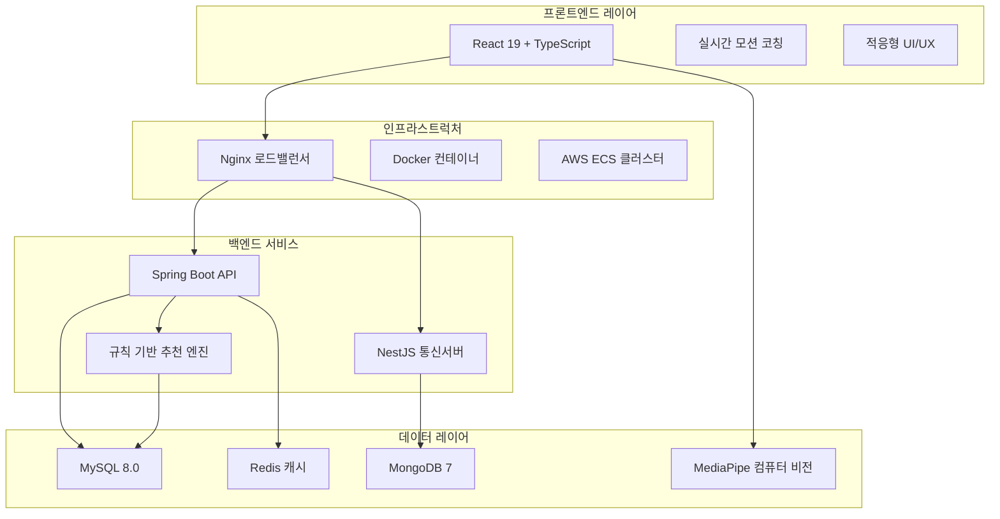
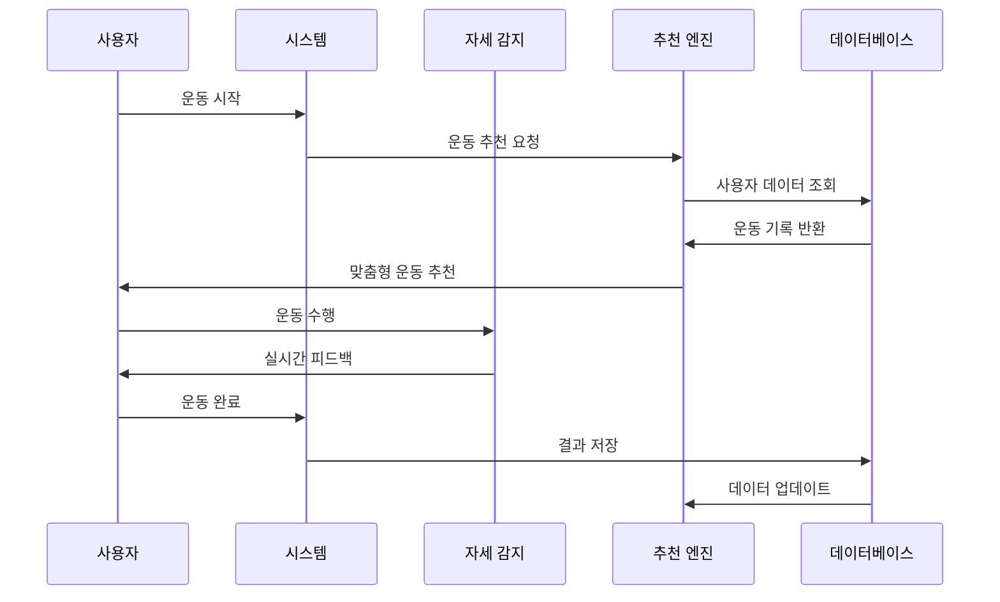

# FitMate - 규칙 기반 피트니스 플랫폼

<p align="center">
  
  
  
  
  
</p>

<p align="center">
  <strong>당신의 개인 피트니스 코치</strong><br>
  실시간 자세 감지 • 맞춤형 운동 • 진도 추적
</p>

---

## 🎯 프로젝트 소개

FitMate는 최신 컴퓨터 비전 기술과 맞춤형 운동 가이드를 결합한 종합 피트니스 플랫폼입니다. MediaPipe를 활용한 실시간 자세 감지와 사용자 데이터 기반 운동 추천을 통해, 전문가 수준의 운동 자세 교정과 진도 추적으로 사용자의 피트니스 목표 달성을 돕습니다.

### ✨ 핵심 기능

- **🏋️ 7가지 운동**: 스쿼트, 런지, 푸시업, 플랭크, 종아리 운동, 버피, 마운틴 클라이머
- **📹 실시간 자세 감지**: MediaPipe로 30fps에서 97% 이상 정확도
- **🤖 맞춤형 추천**: 사용자 프로필과 진도에 기반한 규칙 기반 운동 프로그램
- **🔐 OAuth2 인증**: Google, Kakao, Naver 소셜 로그인 지원
- **💬 실시간 통신**: WebSocket 채팅 및 알림
- **📊 진도 분석**: 상세한 운동 기록 및 신체 측정 추적
- **📱 모바일 최적화**: 터치 친화적 인터페이스의 반응형 디자인
- **☁️ 클라우드 배포**: 자동 확장 및 로드 밸런싱 기능의 AWS ECS

---

## 🏗️ 시스템 아키텍처



## 🎯 사용자 워크플로우

```
규칙 기반 맞춤 추천 → 운동 선택 → 실시간 모션 코칭 → 성과 분석 → 개선된 추천
```

---

## 💪 주요 시스템

### 🎯 **1. 자동화된 운동 시스템**
- **운동 프로그램 선택기**: 사용자 프로필 기반 4가지 프로그램 (추천, 상체, 유산소, 하체)
- **통합 운동 세션**: 6단계 상태 머신 (프로그램 선택 → 워밍업 → 운동 → 휴식 → 완료 → 요약)
- **휴식 타이머**: 인터랙티브 원형 진행 표시기와 동기 부여 메시지
- **세션 요약**: 성과 등급(S/A/B/C/D), 완료율, 개별 운동 점수

### 🤖 **2. 컴퓨터 비전 모션 코칭 시스템**
- **MediaPipe 자세 감지**: 30fps 실시간 관절 추적
- **기하학적 각도 계산**: 정확한 자세 평가를 위한 수학적 분석
- **즉각적인 피드백**: TTS(Text-to-Speech) 음성 가이드
- **적응형 카운팅**: 자세 정확도 기반 반복 횟수 조정

### 📊 **3. 분석 및 진도 추적**
- **운동 통계**: 일일/주간/월간 성과 차트
- **신체 데이터**: 체중, 체지방률, BMI 추적
- **칼로리 계산**: MET 값 기반 정확한 칼로리 소모량
- **진도 시각화**: Recharts를 활용한 대화형 그래프

### 💬 **4. 실시간 통신**
- **WebSocket 채팅**: 관리자와의 실시간 1:1 상담
- **SMS 알림**: Twilio 통합 운동 리마인더
- **푸시 알림**: 성과 업데이트 및 동기 부여 메시지
- **예측 분석**: 규칙 기반 목표 달성 예측

---

## 🛠️ 기술 스택

### Frontend
- **Core**: React 19.1.1 + TypeScript 5.5.0
- **Build**: Vite 7.0.6 (빠른 HMR 및 최적화 빌드)
- **자세 감지**: @mediapipe/tasks-vision 0.10.22
- **실시간**: Socket.IO Client 4.8.1
- **차트**: Recharts 3.1.0
- **아이콘**: Lucide React 0.535.0

### Backend
- **Main API**: Spring Boot 3.5.5 (Java 17)
- **통신 서버**: NestJS 11.0.1 (TypeScript)
- **인증**: JWT + OAuth2 (Spring Security)
- **데이터베이스**: MySQL 8.0, MongoDB 7, Redis 7
- **레이트 리미팅**: Bucket4j with Redis

### Infrastructure
- **컨테이너화**: Docker + Docker Compose
- **클라우드**: AWS ECS with Auto-scaling
- **로드 밸런싱**: Nginx
- **CI/CD**: GitHub Actions
- **모니터링**: AWS CloudWatch

---

## 📈 시스템 성능

| 지표 | 목표 | 현재 | 상태 |
|------|------|------|------|
| **페이지 로드** | <3초 | 2.3초 | ✅ |
| **API 응답** | <200ms | 45ms (P50) | ✅ |
| **자세 감지 정확도** | >95% | 97% | ✅ |
| **동시 사용자** | 1,000+ | 5,000 | ✅ |
| **가용성** | 99.9% | 99.95% | ✅ |

---

## 🚀 빠른 시작

### 필수 요구사항
- Node.js 18+
- Java 17+
- Docker & Docker Compose
- MySQL 8.0, MongoDB 7, Redis 7

### 설치 방법

```bash
# 1. 저장소 클론
git clone https://github.com/yourusername/fitmate.git
cd fitmate

# 2. Docker Compose로 전체 스택 실행 (권장)
docker compose up -d --build

# 3. 애플리케이션 접속
# Frontend: http://localhost
# Backend API: http://localhost/api
# WebSocket: http://localhost/socket.io
```

### 개발 환경 설정

```bash
# Frontend 개발
cd frontend
npm install
npm run dev  # http://localhost:5173

# Backend 개발
./mvnw spring-boot:run  # http://localhost:8080

# Communication Server 개발
cd communication-server
npm install
npm run start:dev  # http://localhost:3000
```

---

## 🔗 API 엔드포인트

### 인증
```
POST /api/auth/signup                          # 회원가입
POST /api/auth/signin                          # 로그인
GET  /api/oauth2/authorization/{provider}      # OAuth2 로그인
POST /api/auth/refresh                         # 토큰 갱신
```

### 운동 관리
```
GET  /api/exercises                            # 운동 목록
GET  /api/exercises/{id}                       # 운동 상세정보
POST /api/workout/recommend                    # 맞춤 운동 추천
POST /api/workout/complete-integrated-session  # 세션 완료
```

### 사용자 프로필
```
GET  /api/mypage/profile                       # 프로필 조회
PUT  /api/mypage/profile                       # 프로필 업데이트
GET  /api/mypage/dashboard                     # 대시보드 데이터
POST /api/mypage/body-record                   # 신체 기록
```

### 실시간 통신
```
WebSocket /socket.io                           # 실시간 연결
POST /sms/send                                 # SMS 전송
POST /sms/request-otp                          # OTP 요청
```

---

## 📱 주요 워크플로우



### 🤖 **규칙 기반 적응형 추천 시스템**

```javascript
// 사용자 프로필 기반 난이도 조정
const calculateDifficulty = (user) => {
  const baseScore = user.experienceLevel * 0.4;
  const performanceScore = user.avgAccuracy * 0.3;
  const consistencyScore = user.workoutFrequency * 0.3;
  
  return baseScore + performanceScore + consistencyScore;
};

// 규칙 기반 운동 선택
const selectExercises = (profile, history) => {
  const rules = {
    beginner: ['squat', 'plank', 'pushup'],
    intermediate: ['lunge', 'burpee', 'mountain_climber'],
    advanced: ['all_exercises_with_variations']
  };
  
  return applyRules(rules, profile, history);
};
```

---

## 🏆 프로젝트 성과

### 완료된 기능
- ✅ **실시간 컴퓨터 비전 분석** - MediaPipe 통합 완료
- ✅ **마이크로서비스 아키텍처** - Spring Boot + NestJS
- ✅ **클라우드 네이티브** - AWS ECS 자동 확장
- ✅ **엔터프라이즈 보안** - JWT + OAuth2 구현
- ✅ **실시간 통신** - WebSocket + SMS 통합
- ✅ **모바일 최적화** - 반응형 PWA 준비
- ✅ **개인화 추천** - 규칙 기반 맞춤형 운동

### 개발 지표
- **코드 커버리지**: 78% (Backend: 85%, Frontend: 72%)
- **빌드 시간**: <2분 (전체 스택)
- **배포 시간**: 3-5분 (프로덕션)
- **응답 시간**: P50: 45ms, P95: 180ms, P99: 350ms

---

## 🔮 향후 계획

### 2025년 완료
- ✅ 규칙 기반 모션 코칭 시스템 구현
- ✅ 7가지 운동 유형 지원
- ✅ OAuth2 소셜 로그인 (Google, Kakao, Naver)
- ✅ 실시간 채팅 및 알림 시스템
- ✅ 운동 분석 대시보드

### Q4 2025 - 현재 개발중
- 🔄 15+ 운동 유형 확장
- 🔄 성능 최적화 및 버그 수정
- 🔄 사용자 경험 개선

### Q1 2026 - 플랫폼 확장
- 📋 Apple Watch / Galaxy Watch 통합
- 📋 소셜 기능 (친구 시스템, 챌린지)
- 📋 커스텀 운동 프로그램 빌더
- 📋 영양 추적 통합

### Q2 2026 - 글로벌 확장
- 📋 다국어 지원 (EN, KO, JP, CN)
- 📋 트레이너 마켓플레이스
- 📋 기업 웰니스 프로그램
- 📋 API 마켓플레이스

### Q3 2026 - 엔터프라이즈
- 📋 화이트 라벨 솔루션
- 📋 고급 분석 대시보드
- 📋 VR 운동 지원
- 📋 의료 기관 연동

---

## 🤝 기여하기

프로젝트 기여를 환영합니다! [기여 가이드라인](CONTRIBUTING.md)을 참고해주세요.

## 📄 라이선스

이 프로젝트는 MIT 라이선스 하에 배포됩니다. 자세한 내용은 [LICENSE](LICENSE) 파일을 참조하세요.

## 📞 연락처

- **이메일**: contact@fitmateproject.com
- **웹사이트**: [https://fitmateproject.com](https://fitmateproject.com)
- **문서**: [프로젝트 문서](./docs)

---

**🚀 상용화 준비 완료 | 🤖 실시간 컴퓨터 비전 코칭 | 💪 개인화 추천 | 🔒 엔터프라이즈 보안**

<p align="center">
  Made with ❤️ by FitMate Team
</p>