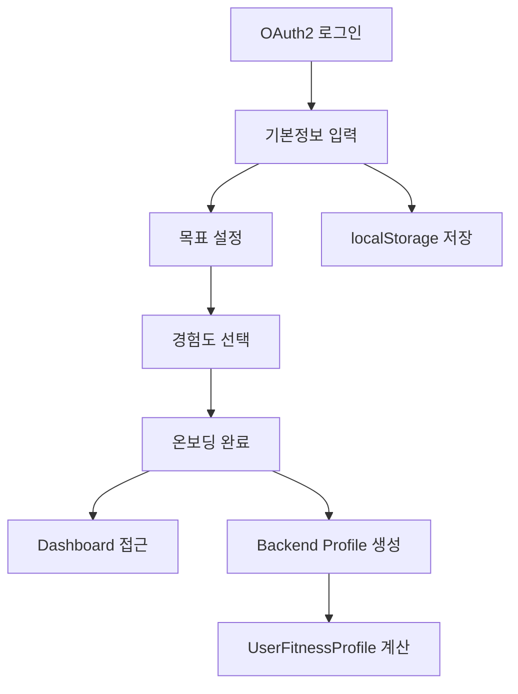
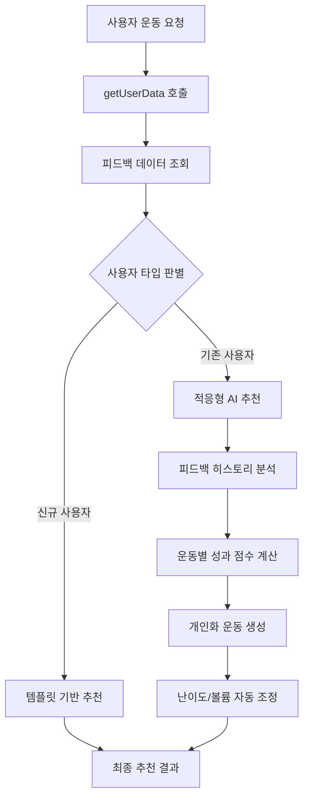
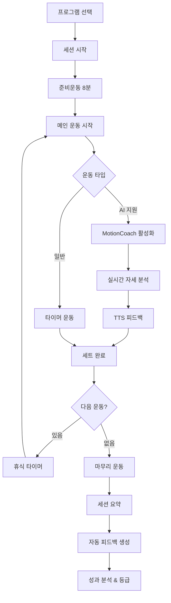
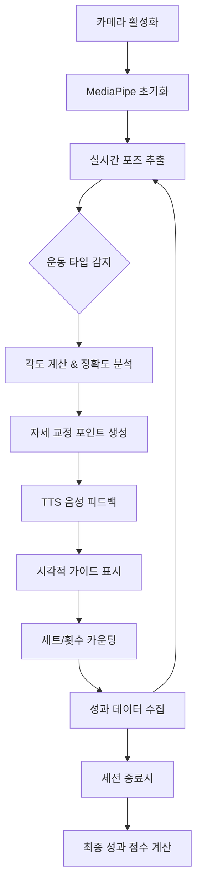
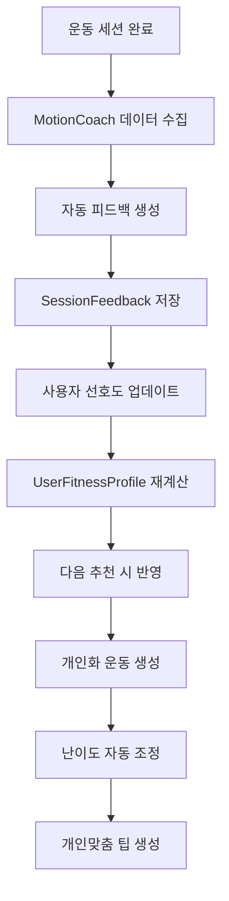

# 🏋️ FitMate 프로젝트 전체 흐름 분석

*최종 업데이트: 2025-08-27*  
*피드백 기반 추천시스템 강화 완료*

## 🏗️ 시스템 아키텍처 개요

### 마이크로서비스 구조
```
📱 Frontend (React + TypeScript + Vite)     🌐 Nginx (Port 80)
    ├── OAuth2 로그인 & 사용자 관리          ├── /api/* → Spring Boot (8080)
    ├── 온보딩 & 프로필 설정                ├── /sms/* → NestJS (3000)  
    ├── AI 운동 추천 & 자동화 시스템         └── /socket.io → NestJS WebSocket
    ├── MotionCoach (실시간 자세 분석)
    ├── 대시보드 & 운동 분석                💾 데이터 저장소
    └── 실시간 채팅 & 알림 시스템           ├── MySQL (사용자, 운동, 피드백)
                                      ├── MongoDB (채팅, 알림)  
🔧 Backend Services                    └── Redis (세션, 캐싱, Rate Limiting)
├── Spring Boot (Java 21) - 메인 API & 비즈니스 로직
├── NestJS (TypeScript) - 실시간 통신 & 알림
└── Docker Compose - 전체 서비스 오케스트레이션
```

### 핵심 기술 스택
- **Frontend**: React 19, TypeScript 5.5, Vite 7.0, MediaPipe, Socket.IO
- **Backend**: Spring Boot 3, Java 21, JWT + OAuth2, Bucket4j Rate Limiting
- **Communication**: NestJS 11, Socket.IO, Twilio SMS, MongoDB
- **Database**: MySQL (메인), MongoDB (채팅), Redis (캐싱)
- **Deployment**: Docker Compose, Nginx 리버스 프록시

## 📊 완전한 사용자 여정

### 1️⃣ **초기 등록 & 온보딩 플로우**



**관련 컴포넌트:**
- `OnboardingBasicInfo.tsx` - 신체정보, 연락처
- `OnboardingGoal.tsx` - 운동 목표 설정  
- `OnboardingExperience.tsx` - 경험도 & 선호도
- `OnboardingComplete.tsx` - 완료 & 첫 추천

### 2️⃣ **지능형 운동 추천 시스템** 🎯



**🔄 새로 강화된 피드백 학습 시스템:**

**자동 피드백 생성** `WorkoutController.java:418-544`
```java
MotionCoach 자세 점수 + 완료율 → 자동 난이도 평가
성과 데이터 → 자동 만족도 계산  
운동 강도 → 자동 에너지 상태 예측
재선택 의향 → 동기 수준 분석
```

**피드백 기반 조정** `AdaptiveWorkoutRecommendationService.java:835-913`
```java
- 난이도 4.0+ → 15% 시간 단축
- 완주율 70%- → 10% 시간 단축  
- 만족도 2.5- → 부담 감소 조정
- 성과 좋은 운동 → 난이도 증가 (최대 +1세트, +10% 반복)
- 성과 나쁜 운동 → 난이도 감소 (최대 -1세트, -10% 반복)
```

### 3️⃣ **통합 자동화 운동 세션** 🤖



**세션 상태 관리** `IntegratedWorkoutSession.tsx`
- `program_selection`: 추천 운동 프로그램 선택
- `warmup`: 준비운동 + 카운트다운 + TTS 가이드  
- `exercise_active`: MotionCoach 자세 분석 + 실시간 피드백
- `exercise_rest`: 휴식 타이머 + 동기부여 메시지
- `session_complete`: 완료 축하 + 성과 요약
- `summary`: 상세 분석 + 등급 시스템 (S/A/B/C/D)

### 4️⃣ **MotionCoach AI 자세 분석** 📹



**지원 운동 타입:** 
- squat, pushup, plank, lunge, calf_raise, mountain_climber, burpee

**실시간 분석 메트릭:**
- 자세 정확도 (0-1.0 점수)
- 운동 속도 & 리듬
- 관절 각도 정확도
- 자세 교정 횟수

### 5️⃣ **피드백 학습 & 개선 사이클** 🔄



## 🔧 핵심 컴포넌트 상세

### **Frontend 컴포넌트 계층**

#### **1. 인증 & 온보딩**
```
OAuth2 → OnboardingBasicInfo → OnboardingGoal → OnboardingExperience → OnboardingComplete
                                     ↓
                        localStorage + Backend Profile 저장
```

#### **2. 메인 대시보드**  
```typescript
// Dashboard.tsx:132-159
loadDashboardData() {
    통합 API 호출 → 목표/통계/추천 데이터 로드
    차트 데이터 변환 → 모바일 최적화 렌더링
}
```

#### **3. 운동 추천 플로우**
```typescript
// WorkoutProgramSelector.tsx:107-165  
loadRecommendedProgram() {
    사용자 프로필 조회 → 백엔드 추천 API 호출
    AI 코칭 지원 운동만 필터링 → 동적 프로그램 업데이트
}
```

#### **4. 통합 운동 세션**
```typescript  
// IntegratedWorkoutSession.tsx
6단계 상태 머신 관리
├── MotionCoach 통합 (Props 전달)
├── TTS 음성 가이드 
├── 실시간 진행률 추적
└── 세션 데이터 수집 & 백엔드 전송
```

### **Backend 서비스 아키텍처**

#### **1. 컨트롤러 레이어**
```java
WorkoutController → 세션 관리 + 자동 피드백 생성
WorkoutRecommendationController → 하이브리드 추천 시스템  
UserController → 프로필 + 피드백 데이터 API
DashboardController → 통합 대시보드 데이터
```

#### **2. 서비스 레이어** 
```java
HybridWorkoutRecommendationService → 추천 방식 선택
├── AdaptiveWorkoutRecommendationService → AI 개인화 추천
└── WorkoutRecommendationService → 기본 템플릿 추천

SessionFeedbackService → 피드백 저장 + 선호도 학습
UserFitnessProfileService → 사용자 프로필 계산
UserExercisePreferenceService → 운동 선호도 관리
```

#### **3. 데이터 레이어**
```java
// Entity 관계
User → WorkoutSession → ExerciseExecution
     → SessionFeedback → UserExercisePreference
     
// 새로 추가된 피드백 분석
FeedbackAnalysis record → 2주간 성과 트렌드 분석
MotionCoachMetrics record → AI 자세 분석 데이터
```

## 📱 실제 사용 시나리오

### **🆕 신규 사용자 (첫 3회 운동)**
1. OAuth2 로그인 → 온보딩 4단계 완료
2. 대시보드 → "운동 시작하기" → 기본 템플릿 추천
3. 운동 세션 → MotionCoach 자세 분석 → 자동 피드백 수집
4. 3회 후 → 적응형 추천으로 자동 전환

### **🎯 기존 사용자 (피드백 학습 완료)**
1. 로그인 → 자동 피드백 분석 실행
2. 경험 레벨 자동 조정 (너무 쉬움/어려움 감지)
3. 개인화 운동 추천 (과거 성과 반영)
4. 맞춤형 난이도 & 개인 팁 제공
5. 세션 후 → 즉시 학습 업데이트

### **🤖 MotionCoach 운동 플로우**
```
카메라 권한 → MediaPipe 로드 → 자세 추적 시작
     ↓
실시간 각도 계산 → 정확도 점수 → TTS "무릎을 더 구부리세요"
     ↓  
세트 완료 감지 → 휴식 타이머 → 다음 세트 자동 시작
     ↓
전체 완료 → 평균 정확도 계산 → 백엔드 성과 데이터 전송
```

## 🔄 데이터 흐름 상세

### **실시간 운동 세션 데이터**
```
Frontend MotionCoach → 자세 분석 → 실시간 점수 업데이트
     ↓
세션 상태 추적 → 진행률 계산 → UI 업데이트
     ↓  
세션 완료 → POST /api/workout/complete-integrated-session
     ↓
Backend 자동 피드백 생성 → DB 저장 → 사용자 프로필 업데이트
```

### **피드백 기반 학습 사이클**
```
SessionFeedback → UserExercisePreference 업데이트
     ↓
UserFitnessProfile 재계산 → 신뢰도 점수 업데이트
     ↓
다음 추천 요청시 → 피드백 히스토리 분석 실행
     ↓
개인화 운동 생성 → 난이도/볼륨 자동 조정 → 맞춤 팁 생성
```

### **WebSocket 실시간 통신** 
```
Frontend Socket.IO ↔ NestJS Communication Server
├── 채팅 메시지 실시간 전송/수신
├── 운동 완료 알림 브로드캐스트  
├── 관리자 응답 시스템
└── 접속 상태 관리
```

## 🛠️ API 엔드포인트 상세

### **🏋️ 운동 관련 API**
```http
# 하이브리드 운동 추천 (템플릿/적응형 자동 선택)
POST /api/workout/recommend
Body: { goal, experience, weight, height, age, workoutFeedback? }
Response: { type: "adaptive"|"template", workoutPlan, feedbackInsights?, ... }

# 통합 운동 세션 완료 (자동 피드백 생성)
POST /api/workout/complete-integrated-session  
Body: { programTitle, exerciseResults, totalDuration, formCorrections, ... }
Response: { sessionId, feedback, improvements }

# 운동 템플릿 조회
GET /api/workout/templates
Response: { templates: [상체, 하체, 유산소, 전신] }
```

### **👤 사용자 관련 API (신규 추가)**
```http
# 사용자 프로필 조회
GET /api/users/{userId}/profile
Response: { user: { goal, experience, weight, height, ... } }

# 사용자 피드백 분석 데이터 (신규)
GET /api/users/{userId}/workout-feedback?days=14  
Response: { 
  feedback: {
    avgSatisfaction, avgDifficulty, avgCompletionRate,
    recentSessionCount, wouldRepeatRatio, recentDifficulty
  }
}
```

### **📊 대시보드 & 분석 API**
```http
# 통합 대시보드 데이터
GET /api/dashboard/data
Response: { goal, stats, recommendation }

# 신체 데이터 트렌드  
GET /api/analytics/body-data
Response: { trends, recentRecords }

# 운동 통계 차트
GET /api/analytics/workout-stats  
Response: { weeklyStats, chartData }
```

### **💬 실시간 통신 API**
```http  
# SMS 알림 (Twilio)
POST /sms/send
POST /sms/request-otp
POST /sms/verify-otp

# WebSocket Events
Client → Server: joinChat, sendMessage, getHistory
Server → Client: chatMessage, newNotification, userJoined
```

## 🔧 핵심 알고리즘 상세

### **적응형 운동 선택 알고리즘** `AdaptiveWorkoutRecommendationService.java:88-150`
```java
운동별 점수 = 목표적합도(25%) + MotionCoach성과(20%) + 개인선호도(20%) 
           + 피트니스레벨적합도(15%) + 세션피드백(10%) + 다양성보너스(10%)

제약조건 적용:
├── 최근 7일 운동 제외 (다양성 보장)
├── 신뢰도 높은 비선호 운동 제외  
├── 신체 부위별 균형 (상체2, 하체2, 코어1, 전신2)
└── 최소 5개 ~ 최대 7개 운동 보장
```

### **자동 피드백 생성 로직** `WorkoutController.java:418-544`
```java
자동 난이도 평가:
- 자세 점수 < 0.6 → +1.5 (어려움)
- 완료율 < 70% → +1.5 (어려움) 
- 소요시간 > 30분 → +0.5 (어려움)

자동 만족도 계산:
- 자세 점수 > 0.8 → +1.0 (만족)
- 완료율 > 90% → +1.0 (만족)
- 완료율 < 60% → -1.0 (불만족)
```

### **경험 레벨 자동 조정** `userProfile.ts:97-107`
```typescript
if (피드백 3회 이상) {
  if (난이도 ≤ 2.0 && 완주율 > 90%) → 레벨업
  if (난이도 ≥ 4.0 && 완주율 < 70%) → 레벨다운
}
```

## 📊 데이터베이스 스키마 & 관계

### **MySQL (메인 데이터)**
```sql
Users (사용자 기본정보)
├── WorkoutSession (운동 세션)
│   ├── ExerciseExecution (개별 운동 실행)
│   └── SessionFeedback (세션 피드백) ⭐ 신규 강화
└── UserExercisePreference (운동 선호도 학습)

Exercise (운동 라이브러리)
└── 1000+ 운동 데이터 (MET, 근육, 장비, 강도)
```

### **MongoDB (실시간 데이터)**
```javascript
ChatMessage (채팅 메시지)
Notification (푸시 알림)  
UserConnection (접속 상태)
```

### **Redis (캐싱 & 세션)**
```
JWT 토큰 검증 캐시
Rate Limiting 데이터 (Bucket4j)
세션별 임시 데이터
```

## 🎯 핵심 개선사항 (2025-08-27 추가)

### **1. 완전 자동화된 피드백 시스템**
- ✅ **자동 피드백**: 사용자 입력 없이 MotionCoach 데이터로 자동 생성
- ✅ **스마트 코멘트**: 자세 점수, 교정 횟수 기반 맞춤 메시지 
- ✅ **성과 추적**: 운동별 개인 발전 상황 자동 분석

### **2. 피드백 기반 적응형 추천**
- ✅ **히스토리 분석**: 최근 2주간 운동 패턴 & 성과 분석
- ✅ **자동 조정**: 난이도/시간/볼륨 개인 성향 기반 최적화
- ✅ **경험 레벨**: 실제 성과 기반 자동 레벨 업/다운

### **3. 개인화 인사이트 UI**
- ✅ **피드백 대시보드**: 만족도, 난이도 트렌드, 완주율, 동기 수준
- ✅ **베스트 운동**: 개인 성과 최고 운동 하이라이트
- ✅ **맞춤 조언**: 피드백 패턴 기반 개인화된 운동 팁

## 🚀 개발 & 배포 워크플로우

### **로컬 개발 환경**
```bash
# 1. 데이터베이스 시작
docker compose up mysql mongo redis -d

# 2. 백엔드 서비스 시작  
./mvnw spring-boot:run                    # Main API (8080)
cd communication-server && npm run start:dev  # 실시간 통신 (3000)

# 3. 프론트엔드 개발 서버
cd frontend && npm run dev               # React 개발서버 (5173)
npm run dev:mobile                       # 모바일 터널 테스트
```

### **프로덕션 배포**
```bash
# 전체 스택 빌드 & 배포
docker compose up -d --build
# → http://localhost (Nginx 통합 서빙)
```

### **테스팅 전략**
- **Frontend**: Vite 테스트 러너 + 컴포넌트 테스팅
- **Spring Boot**: JUnit + @SpringBootTest 통합테스트  
- **NestJS**: Jest 단위테스트 + E2E 테스팅
- **모바일**: Localtunnel로 실제 디바이스 테스팅

## 🔍 모니터링 & 디버깅 

### **애플리케이션 로깅**
- **Spring Boot**: 표준 Spring 로깅 + 성과 메트릭
- **NestJS**: Winston 구조화 로깅 + Socket.IO 이벤트
- **Frontend**: Browser Console + Vite 개발서버 로그

### **헬스체크 & 모니터링**
- Spring Boot Actuator (활성화시)
- NestJS 커스텀 헬스 엔드포인트
- 데이터베이스 연결 상태 모니터링

### **일반적인 문제 해결**
- **CORS 이슈**: `SecurityConfig.java` + `communication-server/src/main.ts`
- **WebSocket 문제**: Socket.IO 클라이언트/서버 버전 호환성
- **피드백 데이터 누락**: MotionCoach 세션 감지 로직 확인
- **추천 정확도 낮음**: 사용자 신뢰도 점수 & 피드백 수량 확인

## 🎯 시스템의 핵심 가치

1. **완전 자동화**: 사용자가 별도 입력 없이도 학습하는 시스템
2. **개인화 극대화**: 개인 운동 패턴 & 성과 기반 맞춤 추천  
3. **실시간 피드백**: MotionCoach AI로 즉시 자세 교정
4. **지속적 개선**: 매 운동마다 더 정확해지는 추천 알고리즘
5. **모바일 최적화**: 터치 기반 UI + 반응형 디자인

이제 FitMate는 단순한 운동 앱이 아닌, 사용자를 깊이 이해하고 함께 성장하는 **AI 피트니스 코치**로 진화했습니다.